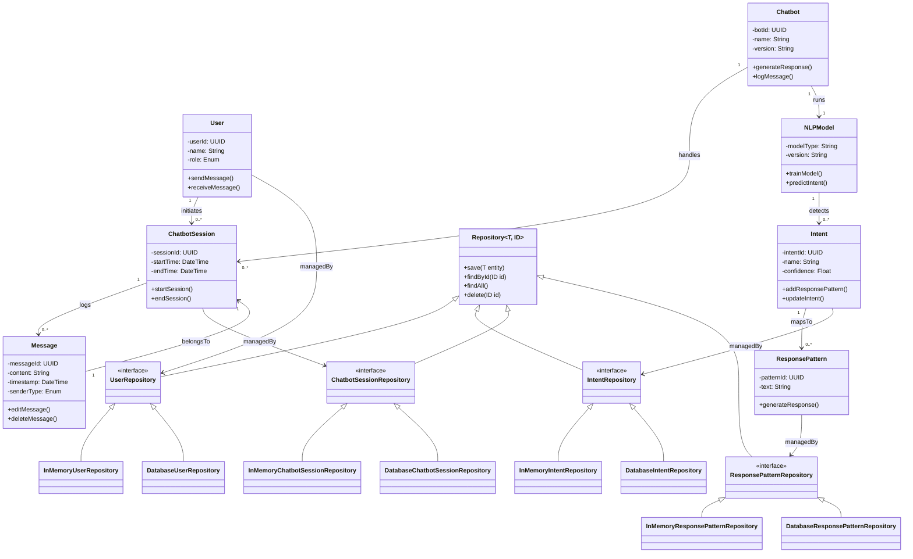

# Class Diagram 

# Key Design Decisions:

- Modeled NLPModel as a separate class to support modularity and future enhancements (e.g., model switching).

- Separated Intent and ResponsePattern for better flexibility in training and response customization.

- ChatbotSession acts as a central hub for User and Chatbot interaction history.

#  Class Diagram Mermaid code
classDiagram
    %% Domain Classes
    class User {
        -userId: UUID
        -name: String
        -role: Enum
        +sendMessage()
        +receiveMessage()
    }

    class Chatbot {
        -botId: UUID
        -name: String
        -version: String
        +generateResponse()
        +logMessage()
    }

    class NLPModel {
        -modelType: String
        -version: String
        +trainModel()
        +predictIntent()
    }

    class ChatbotSession {
        -sessionId: UUID
        -startTime: DateTime
        -endTime: DateTime
        +startSession()
        +endSession()
    }

    class Message {
        -messageId: UUID
        -content: String
        -timestamp: DateTime
        -senderType: Enum
        +editMessage()
        +deleteMessage()
    }

    class Intent {
        -intentId: UUID
        -name: String
        -confidence: Float
        +addResponsePattern()
        +updateIntent()
    }

    class ResponsePattern {
        -patternId: UUID
        -text: String
        +generateResponse()
    }

    %% Relationships
    User "1" --> "0..*" ChatbotSession : initiates
    Chatbot "1" --> "0..*" ChatbotSession : handles
    Chatbot "1" --> "1" NLPModel : runs
    ChatbotSession "1" --> "0..*" Message : logs
    Message "1" --> "1" ChatbotSession : belongsTo
    NLPModel "1" --> "0..*" Intent : detects
    Intent "1" --> "0..*" ResponsePattern : mapsTo

    %% Repositories
    class Repository~T, ID~ {
        +save(T entity)
        +findById(ID id)
        +findAll()
        +delete(ID id)
    }

    class UserRepository {
        <<interface>>
    }
    class IntentRepository {
        <<interface>>
    }
    class ChatbotSessionRepository {
        <<interface>>
    }
    class ResponsePatternRepository {
        <<interface>>
    }

    Repository <|-- UserRepository
    Repository <|-- IntentRepository
    Repository <|-- ChatbotSessionRepository
    Repository <|-- ResponsePatternRepository

    UserRepository <|-- InMemoryUserRepository
    UserRepository <|-- DatabaseUserRepository

    IntentRepository <|-- InMemoryIntentRepository
    IntentRepository <|-- DatabaseIntentRepository

    ChatbotSessionRepository <|-- InMemoryChatbotSessionRepository
    ChatbotSessionRepository <|-- DatabaseChatbotSessionRepository

    ResponsePatternRepository <|-- InMemoryResponsePatternRepository
    ResponsePatternRepository <|-- DatabaseResponsePatternRepository

    %% Link Repositories to Entities
    User --> UserRepository : managedBy
    Intent --> IntentRepository : managedBy
    ChatbotSession --> ChatbotSessionRepository : managedBy
    ResponsePattern --> ResponsePatternRepository : managedBy

